# Documentation on Web-Stack-Implementation-MEAN-STACK-101-105
The MEAN stack is a JavaScript-based framework for developing scalable web applications. The term MEAN is an acronym for MongoDB, Express, Angular, and Node — the four key technologies that make up the layers of the technology stack.

MongoDB: A NoSQL, object-oriented database designed for use with cloud applications
Express(.js): A web application framework for Node(.js) that supports interactions between the front end (e.g., the client side) and the database
Angular(.js): Often referred to as the “front end"; a client-side JavaScript framework used to create dynamic web applications to work with interactive user interfaces
Node(.js): The premier JavaScript web server used to build scalable network applications

## MEAN-Stack-101 : EC2 instace and Virtual Ubuntu Server
AWS account was already created in previously done stack projects. I have created another EC2 instance for MEAN Stack Implentation.

### Created New EC2 instance and Setting up Ubuntu 
- First, created an ec2 instance named it as "Mean_stack_instance" in a region "Stockholm" with instance type "t3.micro", AMI (Amazon Machine Image ) as "ubuntu", at first selected security group having inbound rules for (SSH,HTTP,HTTPS), later on added port 3300 and all other required configuration was selected as default here.
 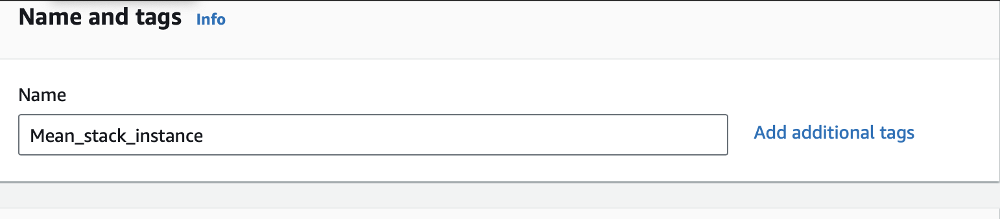
 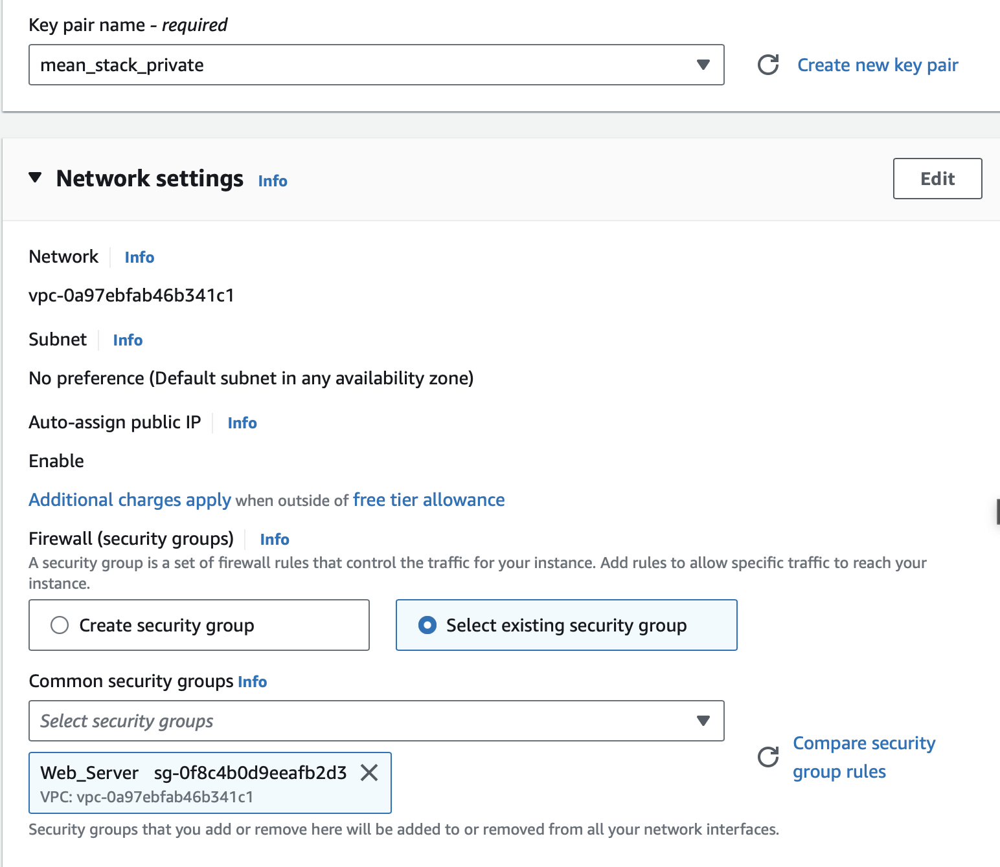
 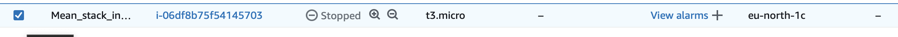
- Latest version of ubuntu was selected which is "Ubuntu Server 22.04 LTS (HVM)". An AMI is a template that contains the software configuration (operating system, application server, and applications) required to launch your instance.
 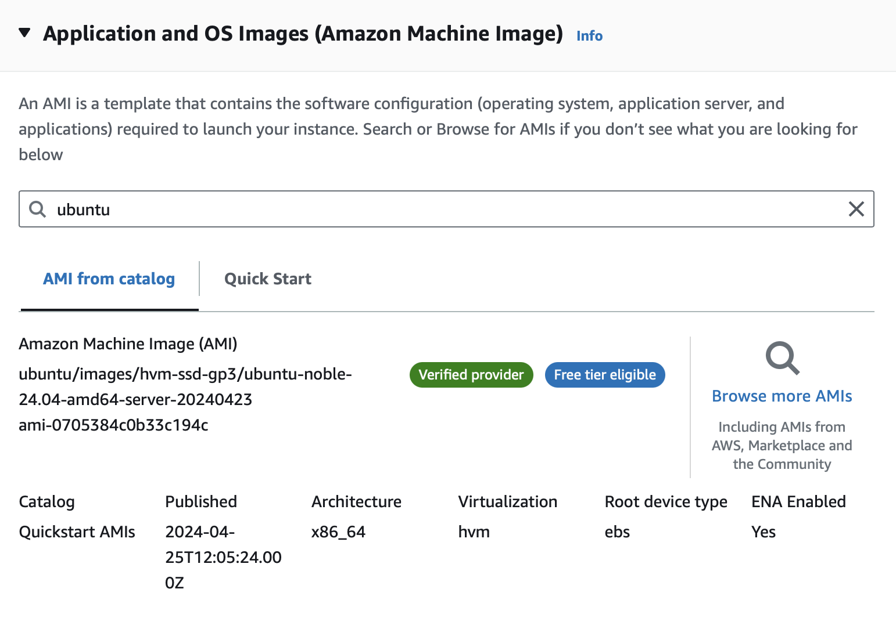
- Private key was generated and named it as : "mean_stack_private" and downloaded ".pem" file.

### Connecting virtual server to EC2 instance
Used the same private key previously downloaded to connect to EC2 instace via ssh :
- Created security group configuration adding ssh and updated this configuration to my ec2 instance to access  TCP port 22.
- Changed the permission for "mern-stack-private.pem" file as :

  ```
    chmod 400 "mean_stack_private.pem"
  ```
- Connected to the instance as
  ```
    ssh -i "mean_stack_private.pem" ubuntu@ec2-16-16-167-154.eu-north-1.compute.amazonaws.com
  ```
  This get changes as you stopped the ec2 instance and run again.
  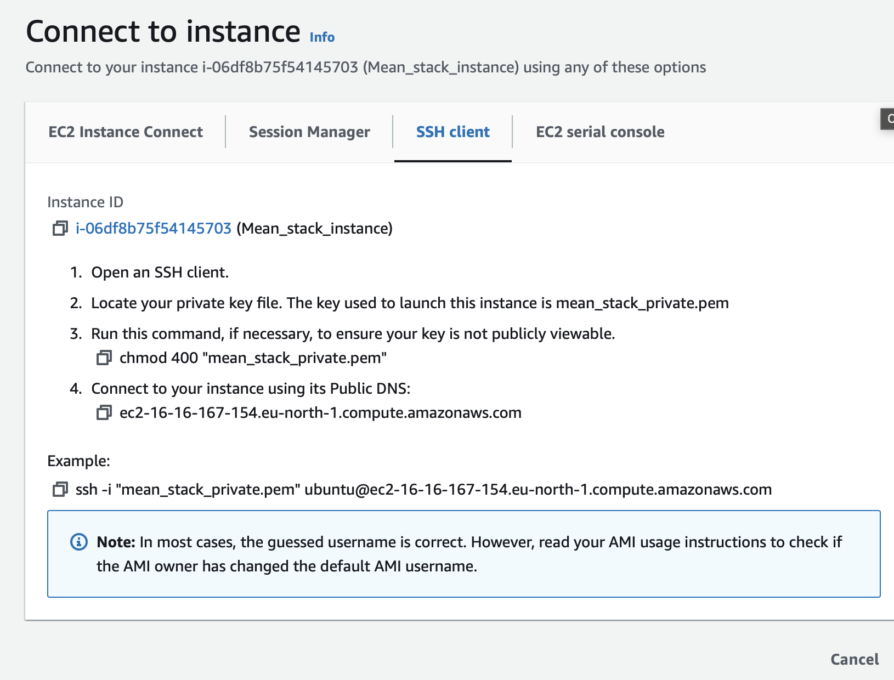

### Conclusion 
Linux Server in the cloud was created.


## MEAN-Stack-102 : Installing Node.js
Node.js is used to set up Express routes and AngularJS controllers.
- Updated and Upgraded ubuntu EC2 instance :
  ```
    sudo apt update
    sudo apt upgrade
  ```
    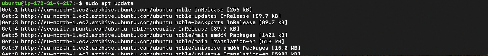
    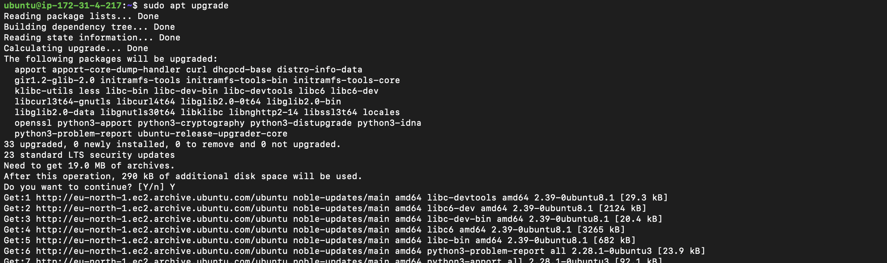
- Added certificates :
  ```
    sudo apt -y install curl dirmngr apt-transport-https lsb-release ca-certificates
    curl -sL https://deb.nodesource.com/setup_12.x | sudo -E bash -
  ```
  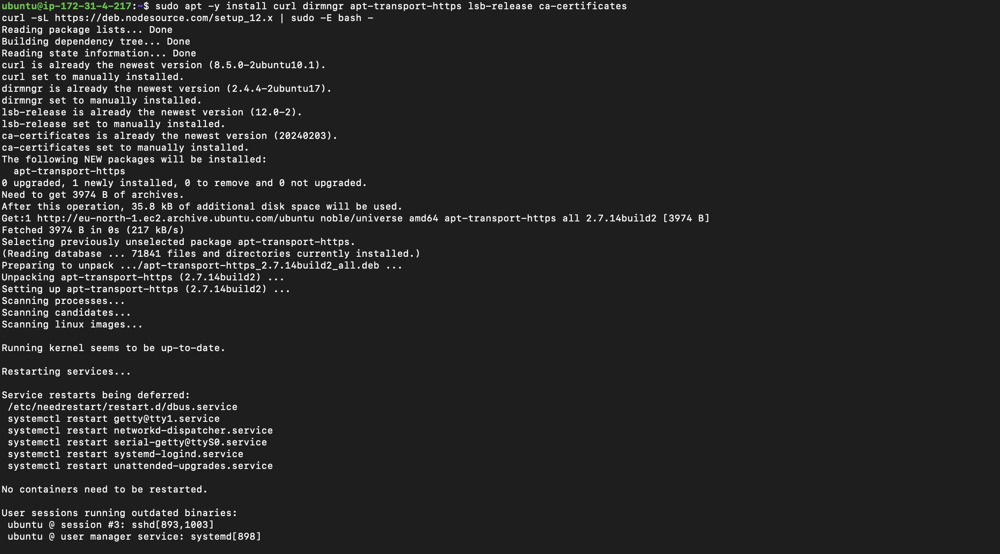
- Installed NodeJS :
  ```
    sudo apt install -y nodejs
  ```
  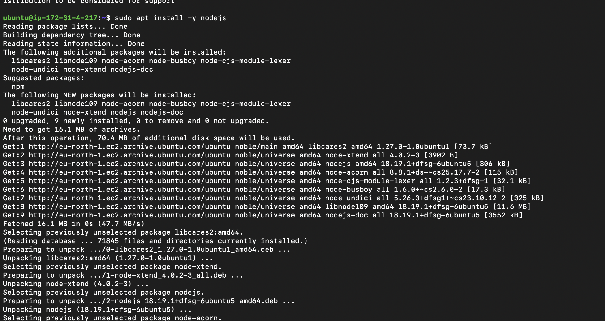
## MEAN-Stack-103 : Installing MongoDB

- Imported Mongodb Repository key
  ```
    curl -fsSL https://pgp.mongodb.com/server-7.0.asc | sudo gpg -o /usr/share/keyrings/mongodb-server-7.0.gpg --dearmor
  ```

- Installed mongodb :
  ```
    echo "deb [ arch=amd64,arm64 signed-by=/usr/share/keyrings/mongodb-server-7.0.gpg ] https://repo.mongodb.org/apt/ubuntu jammy/mongodb-org/7.0 multiverse" | sudo tee /etc/apt/sources.list.d/mongodb-org-7.0.list
  ```
  ```
  sudo apt update
  sudo apt install -y mongodb-org
  ```
  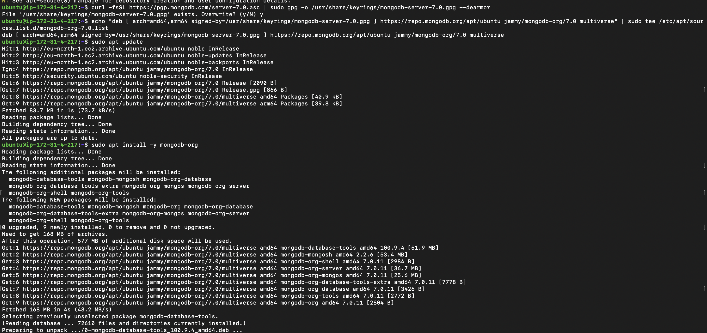

- Checked the version :
  ```
    mongod --version
  ```
- Started the server :
  ```
    sudo systemctl start mongod
  ```
- Checked the status :
  ```
    sudo systemctl status mongod
  ```
- Installed npm (node package manager) :
  ```
    sudo apt install -y npm 
  ```
  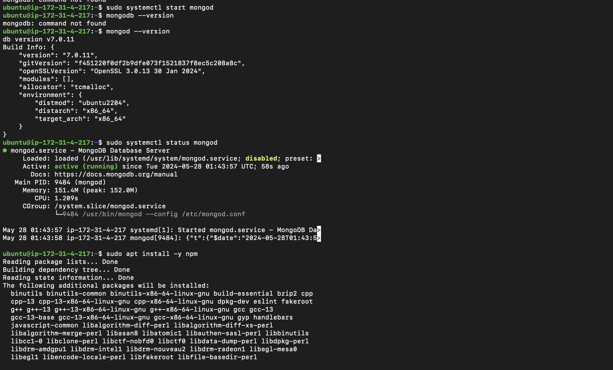
- Installed body-parser package :
  ```
    sudo npm install body-parser
  ```
- Created  s folder named 'Books' :
  ```
    mkdir Books && cd Books 
  ```
- In the Books directory, initialzed npm project :
  ```
    npm init
  ```
  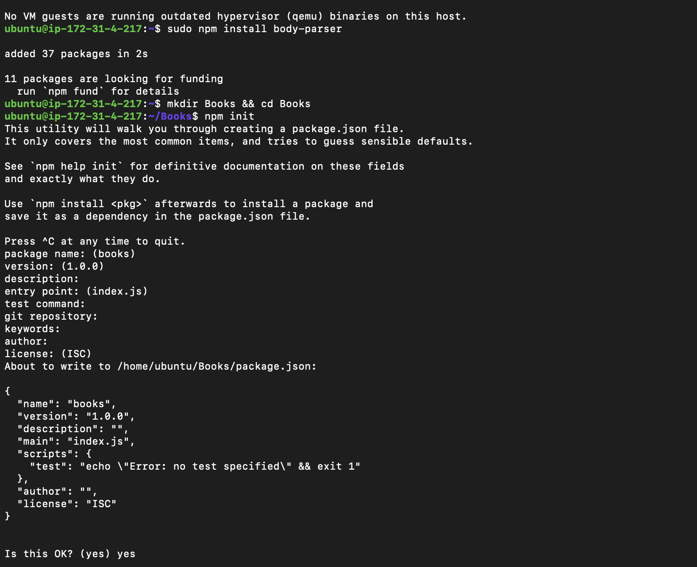
- Added a file to it, opened the file and wrote the code in the file :
  ```
    vi server.js
  ```
  ```
    var express = require('express');
    var bodyParser = require('body-parser');
    var mongoose = require('mongoose');
    var app = express();

    // Connect to MongoDB
    var dbHost = 'mongodb://localhost:27017/test';
    mongoose.connect(dbHost, {
    useNewUrlParser: true,
    useUnifiedTopology: true
    });

    // Handle connection events
    mongoose.connection.on('connected', function() {
    console.log('Mongoose connected to ' + dbHost);
    });

    mongoose.connection.on('error', function(err) {
    console.log('Mongoose connection error: ' + err);
    });

    mongoose.connection.on('disconnected', function() {
    console.log('Mongoose disconnected');
    });

    // Middleware
    app.use(express.static(__dirname + '/public'));
    app.use(bodyParser.json());
    app.use(bodyParser.urlencoded({ extended: true }));

    // Routes
    require('./apps/routes')(app);

    // Start server
    app.set('port', 3300);
    app.listen(app.get('port'), function() {
    console.log('Server up: http://localhost:' + app.get('port'));
    });
  ```
## MEAN-Stack-104 : Installing Expressing and setting up routes to the server


Express is a lightweight and versatile Node.js framework for web and mobile applications. Utilizing Express to transfer book data to and from our MongoDB database.

Additionally, employing  the Mongoose package, which offers a straightforward, schema-based approach to modeling application data. Mongoose will be used to create a schema for our database to store the book register information.
  ```
    sudo npm install express mogoose
  ```
- In 'Books folder, created a folder named apps :
  ```
    mkdir apps && cd apps
  ```
- Created s file named routes.js, opened it and worte the code :
  ```
    vi routes.js
  ```
    
  ```
    var Book = require('./models/book');
    var path = require('path');

    module.exports = function(app) {
    
    // Get all books
    app.get('/book', async function(req, res) {
        try {
        let result = await Book.find({});
        res.json(result);
        } catch (err) {
        res.status(500).json({ error: err.message });
        }
    });

    // Add a new book
    app.post('/book', async function(req, res) {
        try {
        var book = new Book({
            name: req.body.name,
            isbn: req.body.isbn,
            author: req.body.author,
            pages: req.body.pages
        });
        let result = await book.save();
        res.json({
            message: "Successfully added book",
            book: result
        });
        } catch (err) {
        res.status(500).json({ error: err.message });
        }
    });

    // Delete a book by ISBN
    app.delete('/book/:isbn', async function(req, res) {
        try {
        let result = await Book.findOneAndRemove({ isbn: req.params.isbn });
        res.json({
            message: "Successfully deleted the book",
            book: result
        });
        } catch (err) {
        res.status(500).json({ error: err.message });
        }
    });

    // Serve the index.html file for any other routes
    app.get('*', function(req, res) {
        res.sendFile(path.join(__dirname, '../public', 'index.html'));
    });
    };
  ```
- In 'apps' folder created a folder named models, created a file 'book.js' and wrote the code  :
  ```
    mkdir models && cd models
  ``` 
  ```
    vi book.js
  ```
  ```
    var mongoose = require('mongoose');

    var bookSchema = new mongoose.Schema({
       name: String,
       isbn: { type: String, index: true },
       author: String,
       pages: Number
     });
     
     module.exports = mongoose.model('Book', bookSchema);
  ```
## MEAN-Stack-105 : Accessing the routes with AngularJs
Angular Js provides a web framework for creating dynamic views in our web applications. We used AngularJS to connect our web page with Express and perform actions on our book register.
   ```
    cd../..
   ```
- Created a folder named public :
  ```
    mkdir public && cd public
  ```
- Added a file name script.js and wrote the code :
    ```
    var app = angular.module('myApp', []);
    app.controller('myCtrl', function($scope, $http) {
      $http( {
        method: 'GET',
        url: '/book'
      }).then(function successCallback(response) {
        $scope.books = response.data;
      }, function errorCallback(response) {
        console.log('Error: ' + response);
      });
      $scope.del_book = function(book) {
        $http( {
          method: 'DELETE',
          url: '/book/:isbn',
          params: {'isbn': book.isbn}
        }).then(function successCallback(response) {
          console.log(response);
        }, function errorCallback(response) {
          console.log('Error: ' + response);
        });
      };
      $scope.add_book = function() {
        var body = '{ "name": "' + $scope.Name + 
        '", "isbn": "' + $scope.Isbn +
        '", "author": "' + $scope.Author + 
        '", "pages": "' + $scope.Pages + '" }';
        $http({
          method: 'POST',
          url: '/book',
          data: body
        }).then(function successCallback(response) {
          console.log(response);
        }, function errorCallback(response) {
          console.log('Error: ' + response);
        });
      };
    });
    ```
- In 'public' folder, create a file named index.html :
  ```
    <!doctype html>
    <html ng-app="myApp" ng-controller="myCtrl">
    <head>
        <script src="https://ajax.googleapis.com/ajax/libs/angularjs/1.6.4/angular.min.js"></script>
        <script src="script.js"></script>
    </head>
    <body>
        <div>
        <table>
            <tr>
            <td>Name:</td>
            <td><input type="text" ng-model="Name"></td>
            </tr>
            <tr>
            <td>Isbn:</td>
            <td><input type="text" ng-model="Isbn"></td>
            </tr>
            <tr>
            <td>Author:</td>
            <td><input type="text" ng-model="Author"></td>
            </tr>
            <tr>
            <td>Pages:</td>
            <td><input type="number" ng-model="Pages"></td>
            </tr>
        </table>
        <button ng-click="add_book()">Add</button>
        </div>
        <hr>
        <div>
        <table>
            <tr>
            <th>Name</th>
            <th>Isbn</th>
            <th>Author</th>
            <th>Pages</th>
            </tr>
            <tr ng-repeat="book in books">
            <td>{{book.name}}</td>
            <td>{{book.isbn}}</td>
            <td>{{book.author}}</td>
            <td>{{book.pages}}</td>
            <td><input type="button" value="Delete" ng-click="del_book(book)"></td>
            </tr>
        </table>
        </div>
    </body>
    </html>
  ```
   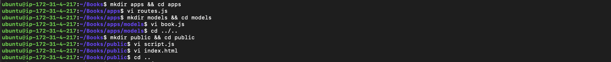

- Changed the directory back up to 'Books' :
  ```
  cd ..
  ```
- Started the server :
  ```
    node server.js
  ```
    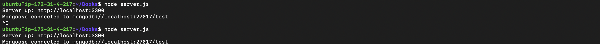

- Output :
    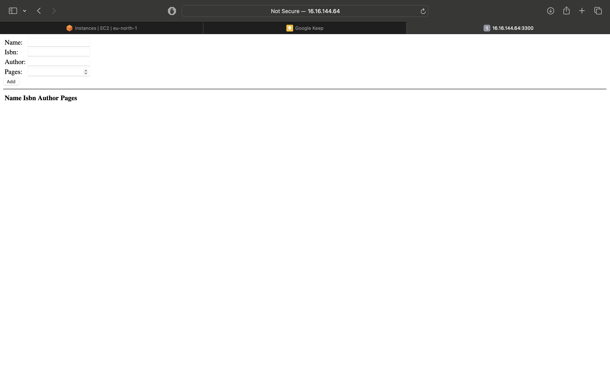
    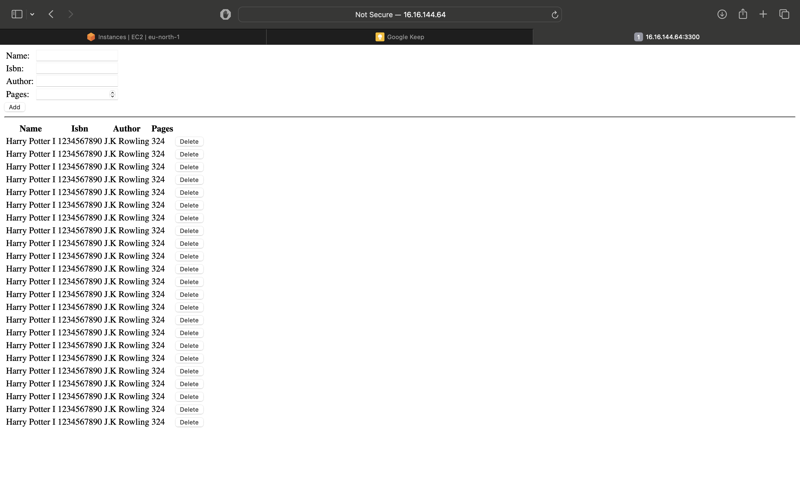

  


